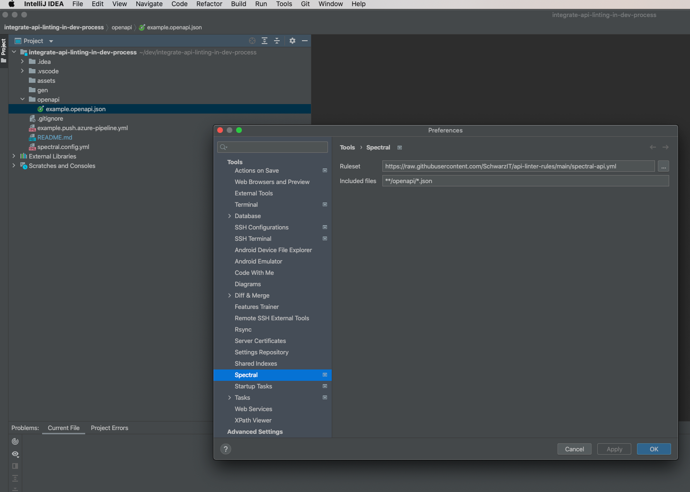

# api-linter-rules

[](https://jobs.schwarz)

Schwarz API spectral custom rulesets to be used with [Spectral Linter](https://github.com/stoplightio/spectral) toolset. You can use this rules to integrate them in your own development workflow or you can build upon your own interpretation of how an API should look like.

Rulesets are based on file inheritance on custom rulesets as supported by [Spectral Rulesets](https://meta.stoplight.io/docs/spectral/ZG9jOjYyMDc0NA-rulesets) assuming that different API types use the same ruleset but different severity levels as provided by [Spectral Custom Rulesets](https://meta.stoplight.io/docs/spectral/ZG9jOjI1MTg5-custom-rulesets). All API type specific rulesets depend on the same [base ruleset file](./spectral.yml) and just overwrite rulesets or severity levels.

Rules Wiki and HowTo´s can be found [here](https://github.com/SchwarzIT/api-linter-rules/wiki).

Example how to overwrite severity levels in [spectral-api.yml](./spectral-api.yml):

```yaml
extends:
  - https://raw.githubusercontent.com/SchwarzIT/api-linter-rules/main/spectral.yml
rules:
  operation-tag-defined: off
  path-must-match-api-standards: warn
  servers-must-match-api-standards: warn
  common-responses-unauthorized: warn
  http-verbs-should-be-used: warn
  no-http-verbs-in-resources: warn
  description-is-mandatory: warn
```

***

## Base ruleset

* Base ruleset is defined in [spectral.yml](./spectral.yml)
* Extends from spectral:oas [recommended rules](https://meta.stoplight.io/docs/spectral/ZG9jOjExNw-open-api-rules)
* Is generated by merging it with all individual rules at build time

```yml
extends: [[spectral:oas, recommended]]
```
## Supported API Types

* Product API ruleset is defined in [spectral-api.yml](./spectral-api.yml)
  ```
  https://raw.githubusercontent.com/SchwarzIT/api-linter-rules/main/spectral-api.yml
  ```
* Backend For Frontend is defined in [spectral-bff.yml](./spectral-bff.yml)
  ```
  https://raw.githubusercontent.com/SchwarzIT/api-linter-rules/main/spectral-bff.yml
  ```
* Legacy API is defined in [spectral-legacy.yml](./spectral-legacy.yml)
  ```
  https://raw.githubusercontent.com/SchwarzIT/api-linter-rules/main/spectral-legacy.yml
  ```

## Local usage in IDE

### Visual Studio Code

* Install [Spectral Linter for VS Code](https://github.com/stoplightio/vscode-spectral)
* Copy rules in your repo and create VS Code settings as described in the plugin repo OR just reference the desired API type validation from this repository like shown underneath:

1. Create "spectral.config.yml" in the root of you repository and paste below content into it

```yaml
extends:
- https://raw.githubusercontent.com/SchwarzIT/api-linter-rules/main/spectral-{API_TYPE}.yml
````

2. Adapt VS Code settings in .vscode/settings.json

```json
"spectral.rulesetFile": "./spectral.config.yml",
"spectral.validateFiles": [
    "**/openapi/**/*.json",
],
```
3. Place your open api spec in a folder called "openapi"

4. Enjoy API Linting

### Jetbrains IDE family

* Install [Spectral Linter for Jetbrains IDE´s](https://github.com/SchwarzIT/spectral-intellij-plugin)

* Open Jetbrains IDE preferences/tools/spectral and configure source rule set (see API Types above) for API linting and files to be linted



* Enjoy API linting in Jetbrains IDE family


## Usage in CI

Comming soon..

## Usage in API design first approach

Comming soon..

## Building

In order to save on http requests, when using one of the rulesets, the individual rules are not extended but bundled.
In a build step all individual rules are collected and merged into the file spectral.yml.
Splitting our ruleset into individual rules also improves maintainability as well as testing.

For this the cli tool [yq](https://github.com/mikefarah/yq) is used.
So in order to build the rules you need to have it installed locally. (See [installing yq](https://github.com/mikefarah/yq#install))

Also keep in mind, that the rules are built using bash scripts. So if you're on windows, you might want to use something like GitBash or [WSL](https://docs.microsoft.com/de-de/windows/wsl/about)

### CI

During CI the same tool and script is used to merge the Rules.
Afterwards the script [checkSpectralYaml.sh](./util/scripts/checkSpectralYaml.sh) is executed to find out whether the commited spectral.yml is up to date.
If that's not the case, the pipeline fails asking you to build the rules before committing.
If [spectral.yml](./spectral.yml) is valid, the api type specific rulesets will be checked. Each of them must specify a severity for every rule inside [spectral.yml](./spectral.yml).

## Testing

To test our ruleset we decided to split it into individual rulesets containing only one rule.
As written above, all individual rules will be merged during build.
Splitting the ruleset enables us to test each rule isolated from the others.
To do this we created a custom [jest-transformer](./util/transforms/spectralRuleTransformer.js) for `.yml` files.
That way it's possible to just import an individual rule in a test and use it.

Example:

```ts
import { Spectral } from "@stoplight/spectral-core";
import ruleset from "./path-must-match-api-standards.yml";

describe("path-must-match-api-standards", () => {
  let spectral: Spectral;
  
  beforeEach(() => { spectral = setupSpectral(ruleset); });

  it("has a correct path", async () => {
    const result = await spectral.run(`{"paths": {"/api-linting/api/v1/rules": {}}}`);
    expect(result).toHaveLength(0);
  });
};
```

[setupSpectral()](./util/jest.setup.ts) is a global utility function that creates a usable Spectral instance from a ruleset.

## Documentation

Since it would be pretty cumbersome to document the wiki pages of this project for all rules, we decided to automate this process.
On every push to main the [wiki-pipeline](.github/workflows/wiki-pipeline.yml) checks out the wiki-repo, re-builds the documentation and pushes it to the wiki-repo.
The documentation is generated by extracting the head comment of all the individual rules. So a comment like this:

```yaml
# Comment shown in Wiki description
# **bold text**

rules:
  ## Comment shown in source code ##
  path-must-match-api-standards:
```

Is turned into a heading with the rule name, the upper comment, the severity levels specified inside the `spectral-*.yml` files and the implementation of the rule.
It's even possible to use Markdown inside the head comment like in the example above.
