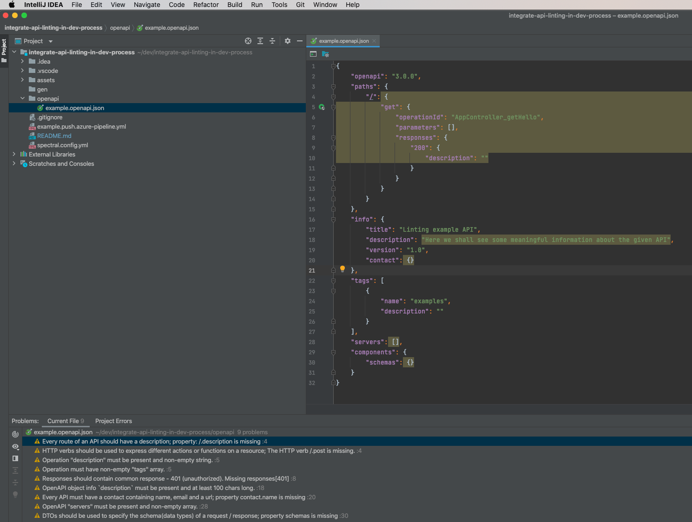

# api-linter-rules

[](https://jobs.schwarz)

Schwarz API spectral custom rulesets to be used with [Spectral Linter](https://github.com/stoplightio/spectral) toolset. You can use this rules to integrate them in your own development workflow or you can build upon your own interpretation of how an API should look like.

Rulesets are based on file inheritance on custom rulesets as supported by [Spectral Rulesets](https://meta.stoplight.io/docs/spectral/ZG9jOjYyMDc0NA-rulesets) assuming that different API types use the same ruleset but different severity levels as provided by [Spectral Custom Rulesets](https://meta.stoplight.io/docs/spectral/ZG9jOjI1MTg5-custom-rulesets). All API type specific rulesets depend on the same [base ruleset file](./spectral.yml) and just overwrite rulesets or severity levels.

Rules Wiki and HowTo´s can be found [here](https://github.com/SchwarzIT/api-linter-rules/wiki).

Example how to overwrite severity levels in [spectral-api.yml](./spectral-api.yml):

```yaml
extends:
  - https://raw.githubusercontent.com/SchwarzIT/api-linter-rules/main/spectral.yml
rules:
  operation-tag-defined: off
  path-must-match-api-standards: warn
  servers-must-match-api-standards: warn
  common-responses-unauthorized: warn
  http-verbs-should-be-used: warn
  no-http-verbs-in-resources: warn
  description-is-mandatory: warn
```

***

## Base ruleset

* Base ruleset is defined in [spectral.yml](./spectral.yml)
* Extends from spectral:oas [recommended rules](https://meta.stoplight.io/docs/spectral/ZG9jOjExNw-open-api-rules)
* Is generated by merging it with all individual rules at build time

```yml
extends: [[spectral:oas, recommended]]
```
## Supported API Types

* Product API ruleset is defined in [spectral-api.yml](./spectral-api.yml)
* Backend For Frontend is defined in [spectral-bff.yml](./spectral-bff.yml)
* Legacy API is defined in [spectral-legacy.yml](./spectral-legacy.yml)

## Local usage in IDE

### Visual Studio Code

* Install [Spectral Linter for VS Code](https://github.com/stoplightio/vscode-spectral)
* Copy rules in your repo and create VS Code settings as described in the plugin repo OR just reference the desired API type validation from this repository like shown underneath:

1. Create "spectral.config.yml" in the root of you repository and paste below content into it

```yaml
extends:
- https://raw.githubusercontent.com/SchwarzIT/api-linter-rules/main/spectral-{API_TYPE}.yml
````

2. Adapt VS Code settings in .vscode/settings.json

```json
"spectral.rulesetFile": "./spectral.config.yml",
"spectral.validateFiles": [
    "**/openapi/**/*.json",
],
```
3. Place your open api spec in a folder called "openapi"

4. Enjoy API Linting

### Jetbrains IDE family

* Install [Spectral Linter for Jetbrains IDE´s](https://github.com/SchwarzIT/spectral-intellij-plugin)

* Open Jetbrains IDE preferences/tools/spectral and configure source rule set (see API Types above) for API linting and files to be linted


* Enjoy API linting in Jetbrains IDE family



## Usage in CI

Comming soon..

## Usage in API design first approach

Comming soon..
